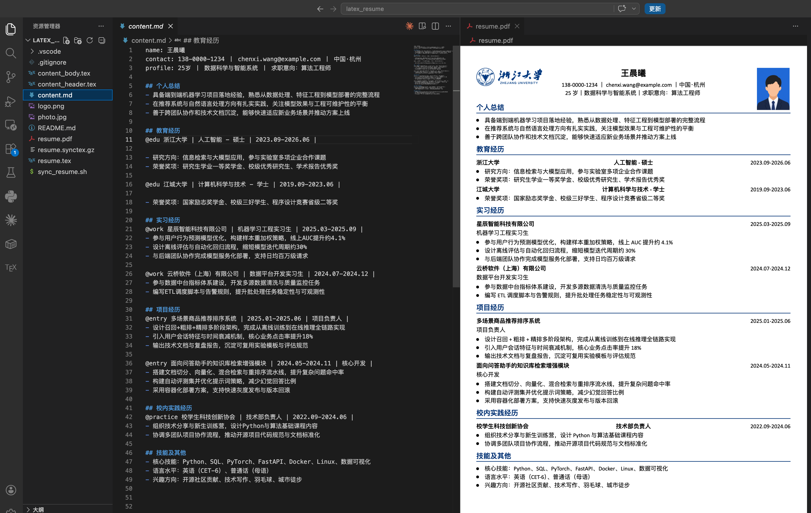

# LaTeX Resume Template

这是一个纯 TeX 的中文简历模板。

不再使用 Markdown 转换流程，直接编辑以下 3 个主文件后编译：

- `resume.tex`（主入口，版式与样式）
- `content_header.tex`（页眉内容）
- `content_body.tex`（正文内容）



## 环境准备

### 1. 安装 VS Code

下载地址：https://code.visualstudio.com/

### 2. 安装 LaTeX 发行版（XeLaTeX）

- macOS：MacTeX
- Windows：TeX Live（或 MiKTeX）

验证命令：

```bash
xelatex --version
```

### 3. 安装 VS Code 插件

安装 LaTeX Workshop（`James-Yu.latex-workshop`）。

## 使用流程

### 1. 编辑内容

- 在 `content_header.tex` 中修改姓名、联系方式、求职意向等页眉信息
- 在 `content_body.tex` 中修改教育、项目、实习等正文内容
- 如需调样式，在 `resume.tex` 中修改字体、颜色、间距和版式

### 2. 编译 PDF

#### VS Code（推荐）

打开 `resume.tex` 后，使用 LaTeX Workshop Build（默认 recipe: XeLaTeX），点击右上角绿色编译运行按钮，打开侧边预览即可实时预览。

编译输出位于 `build/`：

- ==`build/resume.pdf`（即最终生成的简历pdf版本）==
- `build/*.aux`, `build/*.log`, `build/*.synctex.gz` 等中间文件

## 文件结构

```text
.
├── README.md
├── resume.tex
├── content_header.tex
├── content_body.tex
├── photo.jpg
├── logo.png
├── build/                  # 编译输出目录
├── fonts/                  # 内置字体
├── assets/                 # 预览图等静态资源
└── .vscode/settings.json   # LaTeX Workshop 配置
```

## 常见问题

### 编译报字体错误

确认 `fonts/` 目录完整存在，并检查 `resume.tex` 中字体文件名与实际文件名一致（区分大小写）。
